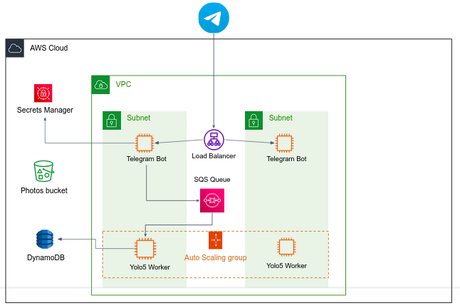
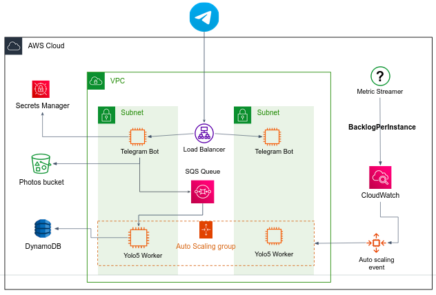

# Provision the Object Detection Service in AWS

**Never commit AWS credentials into your git repo!**

## Background

In this project you will provision well architected Object Detection Service in AWS.

## Infrastructure

You need a VPC with at least two public subnets.

## Provision the `polybot` microservice


### Guidelines

- The Polybot service should be running within a `micro` EC2 instance, as a single Docker container. Code skeleton can be found under `aws_project/polybot`. The container should be running when the machine is launched (use `docker run --restart=always` or any other method).
- Create a prototype EC2 instance with the Polybot container running inside. From that instance create **an AMI** that will be used to launch any other Polybot instance.  
- The service should be highly available (provisioned in at least two different AZ). For that, you'll use an **Application Load Balancer (ALB)** that routes the traffic across the Polybot instances.    
- The ALB must listen on **HTTPS** as setting an HTTP webhook URL in Telegram servers [is not allowed](https://core.telegram.org/bots/webhooks). To use HTTPS you need a TLS certificate. You can get it either by:
  - [Generate a self-signed certificate](https://core.telegram.org/bots/webhooks#a-self-signed-certificate) and import it to the ALB listener. In that case the certificate `Common Name` (`CN`) must be your ALB domain name, and you must pass the certificate file when setting the webhook in `bot.py` (e.g. `self.telegram_bot_client.set_webhook(..., certificate=open(CERTIFICATE_FILE_NAME, 'r'))`).
  
    Or 

  - Use our [shared registered domain](https://us-east-1.console.aws.amazon.com/route53/v2/hostedzones?region=us-east-2#ListRecordSets/Z02842682SGSPDJQMJGFT) (e.g. `my-example-bot.devops-int-college.com`). In the domain **Hosted Zone**, you should create an **A alias record** that routes traffic to your ALB. In addition, you need to request a **public certificate** for your domain address. Since the domain has been issued by Amazon, issuing a certificate [can be easily done with AWS Certificate Manager (ACM)](https://docs.aws.amazon.com/acm/latest/userguide/gs-acm-request-public.html#request-public-console).  
- If you want to limit access to the ALB to Telegram servers only, allow traffic from `149.154.160.0/20` and `91.108.4.0/22` in the ALB security group.
- The service should **not** be auto-scaled, 2 instances are enough.
- Your Telegram token is a sensitive data. It should be stored in [AWS Secret Manager](https://docs.aws.amazon.com/secretsmanager/latest/userguide/intro.html). Create the corresponding secret in Secret Manager, under **Secret type** choose **Other type of secret**.

## Provision the `yolo5` microservice



### Guidelines

- The Yolo5 service should be running within a `micro` EC2 instance, as a single Docker container. The service files can be found in `aws_project/yolo5`. In `app.py` you'll find a code skeleton that periodically consumes jobs from an SQS queue. 
- **Polybot -> Yolo5 communication:** When the bot receives a message from Telegram servers, it should upload the image to the S3 bucket. 
    Then, instead of talking directly with the Yolo5 service using a simple HTTP request, the bot sends a "job" to an **SQS queue**.
    The job message contains information regarding the image to be processed, as well as the Telegram `chat_id`.
    The yolo5 service acts as a consumer, consumes the jobs from the queue, downloads the image from S3, process the image, and writes the results to a **DynamoDB table** (instead of MongoDB, change your code accordingly).
- **Yolo5 -> Polybot communication:** After writing the results to DynamoDB, the Yolo5 service then sends a `GET` HTTP request to the `/results?predictionId=<predictionId>` endpoint of the Polybot, while `<predictionId>` is the current prediction ID. The request is done via the ALB address (HTTPS is not necessary here since this is an internal communication between microservices).
    The `/results` endpoint then retrieve the results from DynamoDB and sends them to the end-user.
- The service should be **auto-scaled**. For that you'll use an **AutoscalingGroup**. In the next section we'll discuss the policy according which this service is going to be scaled in and out. 
- From cost considerations, your ASG desired and minimum capacity **must be 0**.

## Scaling the Yolo5 service: Provision the `metricStreamer` microservice



We now introduce new microservice in the architecture, `metricStreamer`, which will help us to scale in and out the Yolo5 service. 

Obviously, the number of Yolo5 instances needed, depends directly on the numbers of jobs in the SQS queue. 
If the queue is overloaded, we need many Yolo5 instances. If there are only 5 messages in the queue, we don't need 50 instances, right? 

We configure the AutoscalingGroup to perform scale in/out according to the **number of messages in the queue, per Yolo5 instances**. We call this value `BacklogPerInstance`.

For example, assuming you have 10 Yolo5 instances up and running, and 100 jobs in the queue, thus `BacklogPerInstance` equals 10, since each Yolo5 instance has to consume ~10 messages to get the queue empty.
For more information, read [here](https://docs.aws.amazon.com/autoscaling/ec2/userguide/as-using-sqs-queue.html).

The `metricStreamer` microservice's goal is to calculate the value of the `BacklogPerInstance` metric every 30 seconds and [send it to **CloudWatch**](https://boto3.amazonaws.com/v1/documentation/api/latest/guide/cw-example-metrics.html#publish-custom-metrics). 

Here is a code skeleton for this microservice:

```python
sqs_client = boto3.resource('sqs', region_name='')
asg_client = boto3.client('autoscaling', region_name='')

AUTOSCALING_GROUP_NAME = ''
QUEUE_NAME = ''

queue = sqs_client.get_queue_by_name(QueueName=QUEUE_NAME)
msgs_in_queue = int(queue.attributes.get('ApproximateNumberOfMessages'))
asg_groups = asg_client.describe_auto_scaling_groups(AutoScalingGroupNames=[AUTOSCALING_GROUP_NAME])['AutoScalingGroups']

if not asg_groups:
    raise RuntimeError('Autoscaling group not found')
else:
    asg_size = asg_groups[0]['DesiredCapacity']
    
backlog_per_instance = msgs_in_queue / asg_size

# TODO send backlog_per_instance to cloudwatch...
```

### Guidelines

- Implementing and provisioning this service in AWS is up to your choice.
  You can simply wrap the above code with a `while True` loop that iterates every 30 seconds, or using a Lambda function that is being triggered periodically, or any other method... 
- To scale your AutoscalingGroup in/out based on the `BacklogPerInstance` metric, use AWS cli to create a [target tracking scaling policy](https://docs.aws.amazon.com/autoscaling/ec2/userguide/as-using-sqs-queue.html#create-sqs-policies-cli) for your AutoscalingGroup.
  Change `MetricName` and `Namespace` values according to the metric you send to CloudWatch.
  Give the `TargetValue` some value that you can test later (e.g. 10, which means if there are more than 10 messages per Yolo5 in the SQS queue, a scale out event will trigger).
- Create an AMI from a prototype Yolo5 instance and base your **AutoscalingGroup Launch Template** on that AMI, such that when a new instance is created from the launch template, the Yolo5 app will be automatically up and running, starting to consume jobs from the SQS queue.

### General guidelines 

- Throughout the exercise you should not use IAM user credentials explicitly, instead, **use IAM roles** with the required permissions and attach them on your EC2 instances.
- Test your application under load, observe the `BacklogPerInstance` metric values in CloudWatch. Watch how CloudWatch firing a **scale out alarm** which increasing the desired capacity of your AutoscalingGroup, and when the `BacklogPerInstance` value is low, watch the **scale in alarm** fired.
- You are highly encouraged to improve the bot logic, add functionality etc...


## Submission

You have to present your work to the course staff, in a **10 minutes demo**.

# Good Luck
