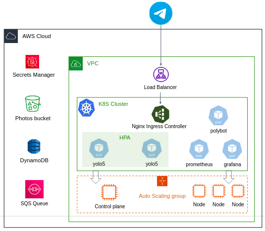
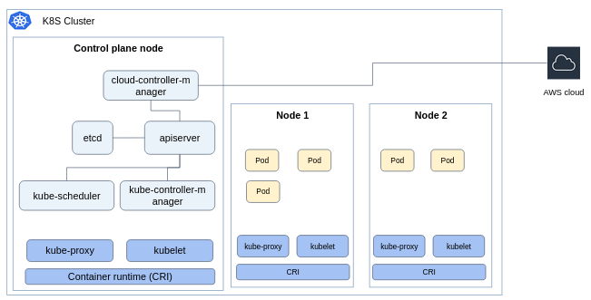
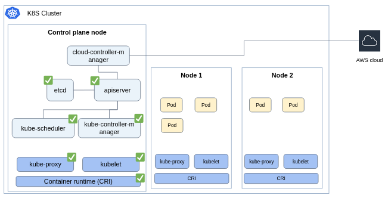
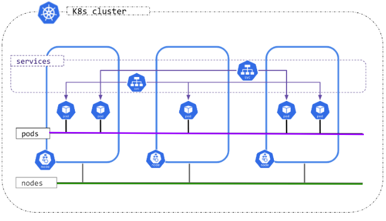

# Deploy the Object Detection Service in Kubernetes

**Note**: This project doesn't use the EC2 instances and ASG from the previous AWS project.  

## Background

In this project you'll build a production-quality Kubernetes cluster by hands (!) using EC2 instances, then deploy the Object Detection Service in it, in addition to a few more observability tools.

## Provision infrastructure

Here is a higher level of the underlying infrastructure:




- Your cluster is based on Ubuntu `medium` instances. One instance is the **control plane**, the other ones are **worker node**.
- A VPC with at least two public subnets in different AZs.

## Kubernetes cluster components

Let's recall the [Kubernetes architecture](https://kubernetes.io/docs/concepts/architecture/):



The control plane node contains: 

- `apiserver` - the frontend for the Kubernetes API.
- `etcd` - database to store for all cluster data.
- `kube-scheduler` - selects a node for pods to run on.
- `kube-controller-manager` - a component that runs controller processes (CronJobs, Deployments, ReplicaSet, StatefulSet, and much more..).
- `cloud-controller-manager` - lets you link your cluster into AWS API (for example to provision EC2 instances, or ELB).

Each node (including the control plane node) contains:

- `kubelet` - the k8s agent that runs on each node in the cluster, responsible for Pods lifecycle.
- `kube-proxy` - a network proxy that runs on each node in your cluster, implementing part of the k8s Service concept.
- **Container runtime** - the engine that runs containers (e.g. Docker, CRI-O). The container runtime must implement the [Container Runtime Interface (CRI)](https://github.com/kubernetes/community/blob/master/contributors/devel/sig-node/container-runtime-interface.md).

## Create the control plane node

In this section we deploy the control plane node.

### Infrastructure 

Create an **IAM role** to assign to your control plane machine with the following permissions:

  - `AmazonEKSClusterPolicy` - permissions required for the control plane to provision infrastructure in AWS.
  - `AmazonEC2ContainerRegistryFullAccess` - to retrieve ECR password and pull images.
  - `AmazonEBSCSIDriverPolicy` to create EBS volumes and bound them to PersistentVolume. 

Create a single **security group** that will be used for all cluster's nodes (both control plane and worker nodes). 
Essentially, traffic between cluster's nodes should flow seamlessly:

  - Accept all TCP incoming traffic from instances on the same VPC. 
  - Accept all UDP incoming traffic from instances on the same VPC.
  - Accept incoming traffic on port 22 from all addresses.
  - If you want to access your cluster's API from your local machine, accept port `6443` from all addresses. 

Create a `medium` Ubuntu EC2 instance. Choose a VPC with at least 2 public subnets. Choose your security group and IAM role. 

### Install container runtime 

Connect to your instance and install required tools: `jq` and `awscli`.

**Carefully** read and follow https://kubernetes.io/docs/setup/production-environment/container-runtimes/ to install a container runtime on your node. 
You should choose a container runtime for your cluster's nodes from the list provided in the docs.  

> [!TIP]
> As mentioned above, each node in the cluster has to have a container runtime that implements the [CRI](https://github.com/kubernetes/community/blob/master/contributors/devel/sig-node/container-runtime-interface.md). 
> Note that Docker Engine itself doesn't implement the CRI, and an additional adapter, `cri-dockerd`, has to be installed. 
> 
> If you look for another container runtime to go with, `cri-o` can be simply installed and enabled as a service by:
> ```bash
> curl https://raw.githubusercontent.com/cri-o/packaging/main/get | sudo bash
> sudo systemctl start crio.service
> sudo systemctl enable crio.service
> ```
> 
> But we can assure that other container runtimes - Docker (along with the cri adapter) and `containerd` - are working perfectly. 
> Note that your app containers can run on an engine other than docker, even if they were built with docker.  

> [!NOTE]
> Make sure to execute the instructions under **Forwarding IPv4 and letting iptables see bridged traffic**.

> [!NOTE]
> The **cgroup drivers** section instructs you to verify that both `kubelet` and your container runtime use the same init system (`systemd` is the default init system being used in Ubuntu). 
> 
> We can say that `kubelet` and the `cri-o` container runtime are using `systemd` by default. For other container runtimes you have to check it. 


### Change the machine's `hostname`

In order to integrate the Kubernetes cluster with AWS properly, it is required that your machine's `hostname` would be the same as listed in AWS console.

Usually, your machine's hostname as displayed in AWS console has full form:

```text
ip-172-31-34-113.us-east-1.compute.internal
```

But if you type the `hostname` command from within your instance, it has shortened form:

```text
ip-172-31-34-113
```

Which can lead to bad integration. 

To fix it:

```bash
sudo hostnamectl set-hostname <full-form-hostname>
```

While `<full-form-hostname>` is the hostname from AWS console (e.g. `ip-172-31-34-113.us-east-1.compute.internal`).

### Install `kubeadm`, `kubelet` and `kubectl`

`kubeadm` is the official Kubernetes tool that performs the actions necessary to get a minimum viable cluster up and running. 
We'll use it to bootstrap your cluster. 

**Carefully** read and follow https://kubernetes.io/docs/setup/production-environment/tools/kubeadm/install-kubeadm/.

> [!NOTE]
> As mentioned in the **Before you begin** section, the `kubelet` will fail if swap memory was detected on a node.
> You can disable it by `sudo swapoff -a`. To make this change persistent across reboots, you must also add it to your crontab:
> 
> ```bash
> crontab -e
> ```
> 
> Add the below scheduling rule 
> 
> ```text
> @reboot /sbin/swapoff -a
> ```


### Initializing your control-plane node

Initializing the cluster can be achieved by the [`kubeadm init`](https://kubernetes.io/docs/reference/setup-tools/kubeadm/kubeadm-init/) command. 

The `kubeadm init` command essentially does the below:

1. Runs pre-flight checks.
2. Creates certificates that used by different components for secure communication.
3. Generates `kubeconfig` files for cluster administration.
4. Deploys the `etcd` db as a Pod.
5. Deploys the control plane components as Pods (`apiserver`, `controller-manager`, `scheduler`).
6. Starts the `kubelet` as a Linux service.
7. Install addons in the cluster (`coredns` and `kube-proxy`).

Instead of executing a long command with many flags, it's possible to configure `kubeadm init` with a configuration file:

```yaml
# kubeadm-cluster-config.yaml

apiVersion: kubeadm.k8s.io/v1beta3
kind: ClusterConfiguration
clusterName: kubernetes  # Your cluster name
apiServer:
  # Every IP address can communicate with the API server.
  certSANs:
  - 127.0.0.1
  - 0.0.0.0
  extraArgs:
  bind-address: "0.0.0.0"
  cloud-provider: external
scheduler:
  extraArgs:
    bind-address: "0.0.0.0"
controllerManager:
  extraArgs:
    bind-address: "0.0.0.0"
    cloud-provider: external
networking:
  # These are going to be your Pod's CIDR and Service's CIDR. No need to change.
  podSubnet: "10.244.0.0/16"
  serviceSubnet: "10.96.0.0/12"
---
apiVersion: kubeadm.k8s.io/v1beta3
kind: InitConfiguration
nodeRegistration:
  name: # TODO your hostname here. E.g. ip-172-31-34-113.eu-north-1.compute.internal
  kubeletExtraArgs:
    cloud-provider: external
    node-ip: # TODO your node private ip address here. e.g. 172.31.34.113
```

Change the above manifest according to your node details and init the cluster by:

```bash
sudo kubeadm init --config kubeadm-cluster-config.yaml
``` 

This may take several minutes. After it finishes you should see:

```text
Your Kubernetes control-plane has initialized successfully!

To start using your cluster, you need to run the following as a regular user:

  mkdir -p $HOME/.kube
  sudo cp -i /etc/kubernetes/admin.conf $HOME/.kube/config
  sudo chown $(id -u):$(id -g) $HOME/.kube/config

You should now deploy a Pod network to the cluster.
Run "kubectl apply -f [podnetwork].yaml" with one of the options listed at:
  /docs/concepts/cluster-administration/addons/

You can now join any number of machines by running the following on each node
as root:

  kubeadm join <control-plane-host>:<control-plane-port> --token <token> --discovery-token-ca-cert-hash sha256:<hash>
```

Read the output to understand how to start to use your cluster and how to add nodes. 

> [!NOTE]
> - To run kubeadm init again, you must first [tear down the cluster](https://kubernetes.io/docs/setup/production-environment/tools/kubeadm/create-cluster-kubeadm/#tear-down).
> - The join token is valid for 24 hours. Read here [how to generate a new one](https://kubernetes.io/docs/setup/production-environment/tools/kubeadm/create-cluster-kubeadm/#join-nodes) if needed.
> - For more information about initializing a cluster using `kubeadm`, [read the official docs](https://kubernetes.io/docs/setup/production-environment/tools/kubeadm/create-cluster-kubeadm/). 

What we've deployed so far? 



The only remaining component in the control-plane node in the `cloud-controller-manager`. Let's deploy it. 

### Install the AWS cloud controller manager

The [AWS cloud provider](https://github.com/kubernetes/cloud-provider-aws) provides the interface between a Kubernetes cluster and AWS service APIs. 
This component allows a Kubernetes cluster to provision, monitor and remove AWS resources necessary for operation of the cluster.

In order for the plugin to work properly, **all cluster's related resources (EC2 instances, security group, vpc, etc..) have to be tagged** by the `kubernetes.io/cluster/<cluster-name>` key, with the `owned` value.
`<cluster-name>` is the cluster name as specified in `kubeadm-cluster-config.yaml`.

You can install the plugin by cloning the repo into your control plane machine, and apply all the manifests under `examples/existing-cluster/base`:

```bash
cd cloud-provider-aws/examples/existing-cluster/base
kubectl create -k .
```

Mind the `-k` flag which uses [Kustomization](https://kubernetes.io/docs/tasks/manage-kubernetes-objects/kustomization/) to apply multiple manifests in a single `kubectl` command. 

### Install Pod network addon

At that point you can take a look on your pods:

```bash
kubectl get pods -A
```

And see that some of them (e.g. `coredns`) are in Pending or Crashing condition. 

Why is that? When deploying k8s cluster on AWS, there are 2 layers of networking communication:



- Communication between Nodes (denoted by the green line). This is done for us by AWS VPC.
- Communication between Pods (denoted by the purple line). Although the communication is done on top of the VPC, communication between pods using their own cluster-internal IP address is **not** implemented for us by AWS.   

You must deploy a [Container Network Interface (CNI)](https://kubernetes.io/docs/concepts/extend-kubernetes/compute-storage-net/network-plugins/) network add-on so that your Pods can communicate with each other. 
There are many [addons that implement the CNI](https://kubernetes.io/docs/concepts/cluster-administration/addons/#networking-and-network-policy). 

Here are two good open source projects. Deploy one of them: 

1. **Calico Project**:   
   In the [installation page](https://docs.tigera.io/calico/latest/getting-started/kubernetes/self-managed-onprem/onpremises#install-calico), choose the **Manifests** tab, then follow the instructions for cluster under 50 nodes. 

2. **Flannel**: https://github.com/flannel-io/flannel

This is a good point to **reboot your machine** so changes can be reflected properly.
After that, all cluster pods should be running properly:

```bash
kubectl get pods -A
```

## Join a worker node

Let's join another node to the cluster. 

1. Create another **IAM role** to assign to your worker machines with the following permissions:

  - `AmazonEKSWorkerNodePolicy` - permissions required for the worker node to **read** infrastructure in AWS.
  - `AmazonEC2ContainerRegistryFullAccess` - to retrieve ECR password and pull images.
  - `AmazonEBSCSIDriverPolicy` to create EBS volumes for StatefulSet Pods. 

Create a `medium` Ubuntu EC2 instance. Choose your VPC, choose the security group used for the control-plane node, and IAM role. 

Repeat the some of the steps done in your control-plane node: 

1. Install container runtime. 
2. Change the machine's `hostname`.
3. Install `kubeadm`, `kubelet` and `kubectl`.

Now your machine is ready to be joined to the cluster as a node. Create the following manifest: 

```yaml 
# kubeadm-node-config.yaml

apiVersion: kubeadm.k8s.io/v1beta3
kind: JoinConfiguration
discovery:
  bootstrapToken:
    token: # TODO your join token. E.g. 5didvk.d09sbcov8ph2amjw
    apiServerEndpoint: # TODO your control-plane API server ip and port. E.g. 172.31.38.150:6443  
    caCertHashes:
      - # TODO token ca cert hash. e.g. sha256:aced39939a479d2fe513f96dbc7c7030f0b2e04fa82b4d37314446a2d05e721a 
nodeRegistration:
  name: # TODO your instance hostname. E.g. ip-172-31-42-153.us-east-1.compute.internal
  kubeletExtraArgs:
    cloud-provider: external
```

Join the node by:

```bash
sudo kubeadm join --config kubeadm-node-config.yaml
```

From your control-plane node, perform:

```bash
kubectl get nodes
```

And make sure you see the joined node. 

## Install cluster addons

### Get ECR login password periodically

If you are using ECR to store images, your cluster has to have the credentials needed to pull images (similarly as done when you push an image from your local machine). 

This can be done by creating a k8s Secret of type `docker-registry` provided with Docker registry URL, username, and password. 
The problem is that the ECR registry password is changing every 12 hours. Thus, we have to update the secret value accordingly. 

Here is a simple bash script that update/create the ECR credentials for all namespaces in the cluster. 
Create it on the control-plane node while changing some of the values accordingly. Make the file is executable and define a crontab that executes the script every an hour (or any time less than 12 hours) and on machine reboot:


```bash 
AWS_REGION=<your-region>
ECR_TOKEN=$(aws ecr get-login-password --region $AWS_REGION)
AWS_ACCOUNT=<your-account-number>

for NS in $(kubectl get ns --no-headers -o custom-columns=":metadata.name")
do
  kubectl delete secret --ignore-not-found ecr-docker-creds -n $NS 
  kubectl create secret docker-registry ecr-docker-creds --docker-server=https://${AWS_ACCOUNT}.dkr.ecr.${AWS_REGION}.amazonaws.com --docker-username=AWS --docker-password="${ECR_TOKEN}" --namespace=$NS
  kubectl patch serviceaccount default -p "{\"imagePullSecrets\": [{\"name\": \"ecr-docker-creds\"}]}" -n $NS
  echo "Secret was successfully updated at $(date)"
done
```

To open the crontab editor:

```bash
crontab -e
```

And enter the below schedules

```text
@reboot /path/to/update_secret.sh
0 * * * * /path/to/update_secret.sh
```

### Install the EBS CSI driver addon

The EBS Container Storage Interface (CSI) driver create and attach EBS volumes as storage for your Pods. 
The volumes exist regardless the cluster node's disk, so the data can persist. 

Install the addon from the [official project repo](https://github.com/kubernetes-sigs/aws-ebs-csi-driver/blob/master/docs/install.md).

> [!TIP]
> It's recommended using the Helm chart installation.


### Install Dashboard 

You can deploy the dashboard from the official docs: 

https://kubernetes.io/docs/tasks/access-application-cluster/web-ui-dashboard/

Keep in mind that as opposed to Minikube which allows free access to the dashboard, now you have to create a token to access the dashboard. 
Follow the instructions in the docs. 

If you want to visit the dashboard from your local browser, make sure to open relevant ports in the control-plane security group, and to perform the `kubectl proxy` or the `kubectl port-forward` command along with the `--address 0.0.0.0` flag. 

## Deploy the Object Detection service

Well done! at this point you have an up and running kubernetes cluster. In this section we will deploy the Object Detection Service in the cluster.

#### Source code repo

Create a dedicated GitHub repo with the source code of the project. In the repo, create a directory called `k8s` in which you create the different YAML manifests. 

#### Docker images

Store your Docker images in either ECR or DockerHub.

#### `polybot` and `yolo5` manifests

Create YAML manifests for the `polybot` and `yolo5` microservices workloads.

Notes:

  - Configure liveness the readiness probes for your workloads. Create dedicated endpoints in the app code if needed.
  - Configure resources requests and limit. As this project is not a real product, try to reduce resources cost, **don't require a lot of CPU and memory**.  
  - The `yolo5` should be autoscalable (using `HPA`) by CPU utilization. Make sure the `yolo5` scales properly. 
  - The services should terminate gracefully. You should write some code that catches the `SIGTERM` send by the `kubelet` before the container is terminated (for example is case of rolling update), then stop the container work and terminate it with exit code 0.  

#### Telegram integration

Incoming traffic from Telegram servers into your cluster is done through the **Nginx ingress controller**. 
You have to install the Nginx ingress controller as done in class, then to configure the `Ingress` object which routes traffic to your `polybot`.

Create a subdomain alias record in our [shared registered domain](https://us-east-1.console.aws.amazon.com/route53/v2/hostedzones?region=us-east-2#ListRecordSets/Z02842682SGSPDJQMJGFT) (e.g. `my-example-bot.devops-int-college.com`) that resolved to your NLB.
Since your `Ingress` should perform the [TLS termination](https://kubernetes.github.io/ingress-nginx/examples/tls-termination/) (not the ELB as done in previous exercises), you should [generate a self-signed certificate](https://core.telegram.org/bots/webhooks#a-self-signed-certificate) with your bot domain as Common Name.

#### Service monitoring 

Deploy Grafana server, which persists data in a `2Gi` EBS disk. 
Integrate it with [AWS CloudWatch](https://grafana.com/docs/grafana/latest/datasources/aws-cloudwatch/) and build dashboard that displays [metrics about your SQS queue](https://docs.aws.amazon.com/AWSSimpleQueueService/latest/SQSDeveloperGuide/sqs-available-cloudwatch-metrics.html).  

Deploy FluentD that streams cluster logs into a dedicated database, to your choice (you can use Elasticsearch as done in class, you can even make your life easier and send logs to CloudWatch).
Integrate Grafana to watch the logs.
Use the [official Helm chart](https://github.com/fluent/helm-charts/tree/main/charts/fluentd).

Deploy Prometheus server in any way you prefer. Integrate with Grafana and configure the following dashboards:

- Import or create some dashboard with information about your cluster nodes.
- [Configure the nginx to expose metrics to prometheus](https://kubernetes.github.io/ingress-nginx/user-guide/monitoring/), create a dashboard with information related to your Nginx ingress controller, specifically, the number of incoming requests (per second/minute) and the expiration time of your ingress TLS certificate.


## Implement the event sourcing pattern in your cluster

Event sourcing is a design pattern commonly used in microservices architectures where the state of an application is determined by a sequence of events that have occurred. 

In this section you'll implement two new microservices for your Object Detection Service. 

- The `metering` service which responsible to collect and calculate usage information per Telegram user. 
- The `model-analyzer` service which responsible to collect predictions results of the yolo5 service.  

Obviously, these two microservices has to have an access to prediction event occurring in the system.

Event sourcing microservice - predictions service api - another queue - predictions, model version (yolo docker version) 
We store results for a short time, from regulatory constraints we can't allow data analyst team to access user data. 

## (optional but highly recommended) Node scaling

Create an autoscaling group for cluster worker nodes (only worker nodes, not control-plane nodes) so you can increase/decrease the cluster node size by a click of a mouse. 

Guidelines: 

- In the control plane node, create a `crontab` task that generates a join token every 24 hours (`kubeadm token create`) and stores the secret in a dedicated secret in AWS Secret Manager. 
- Create an AMI with all worker node prerequisites in it (network configurations, container runtime, kubeadm, kubelet, etc..). 
- In your launch template, create a [User data](https://docs.aws.amazon.com/AWSEC2/latest/UserGuide/user-data.html) script that:
  - Modify the instance `hostname` as described in above section (see tip below).
  - Fetch the join token from the Secret Manager.
  - Creates a `kubeadm-node-config.yaml` file with relevant node values
  - Join the node to the cluster using the `kubeadm join` command.

[!TIP]
To dynamically fetch the instance hostname as displayed in AWS console you can utilize the [EC2 instance metadata API](https://docs.aws.amazon.com/AWSEC2/latest/UserGuide/instance-metadata-v2-how-it-works.html):

```bash
TOKEN=`curl -X PUT "http://169.254.169.254/latest/api/token" -H "X-aws-ec2-metadata-token-ttl-seconds: 21600"`
INSTANCE_HOSTNAME=$(curl -H "X-aws-ec2-metadata-token: $TOKEN" http://169.254.169.254/latest/meta-data/hostname)
```

Test it:

- Increase the number of your ASG and perform `kubectl get nodes` from the control plane node to see the joined node. 
- In order to decrease the nodes gracefully, you need to [safely darin the node](https://kubernetes.io/docs/tasks/administer-cluster/safely-drain-node/), as follows:
  1. First, detach the instance from the ASG while keep it running:
     ```bash
     aws autoscaling detach-instances --instance-ids <instance-id> --auto-scaling-group-name <asg-name> --should-decrement-desired-capacity 
     ```
  2. Drain the node.
  3. Terminate the instance. 


# Good Luck
