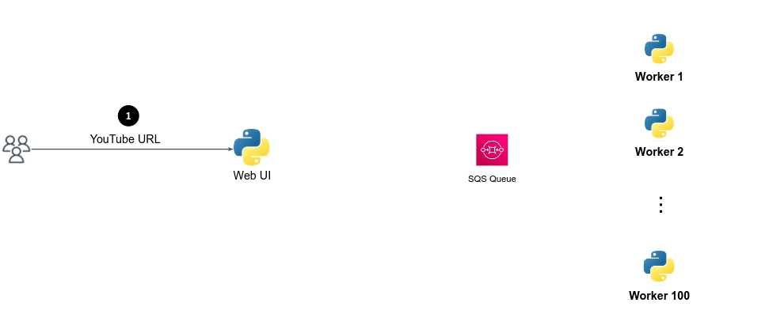

# Simple queue service and simple notification service

# Motivation for queueing systems 

As a motivation example for using queues systems, let's build simple "speech-to-text" system, inspired by the YouTube automatic speech recognition. 

YouTube's video subtitle feature provide users with a text-based translations of the spoken content in the video.
YouTube's automatic speech recognition system uses AI algorithms to analyze the audio content of videos and convert spoken words into text in a near-real-time latency. 

Our system is composed by two microservices (`frontend` and `worker`) as described below:


1. The `frontend` microservice acts as a user web interface, allows users to provide a link to YouTube video and click the submit button to start the processing (**step 1**).
2. The `frontend` create an HTTP request to the `worker` microservice (**step 2**) that responsible for downloading the video from YouTube servers, convert the audio file format and recognize text in the audio file using an AI model called [`openai/whisper-tiny`](https://huggingface.co/openai/whisper-tiny) (**step 3**).
3. The `worker` service then responds to the `frontend` service with the resulted text (**step 4**).
4. The `frontend` service responds to the end-user (**step 5**).

Let's do it...

### Demonstration

The demo code can be found under `youtube_subtitles_v1`.

1. Install `ffmpeg` by `sudo apt-get update && sudo apt-get install ffmpeg`. 
2. Install requirements of both applications by: 

```bash
pip install -r youtube_subtitles_v1/frontend/requirements.txt
pip install -r youtube_subtitles_v1/worker/requirements.txt
```

3. Launch the `frontend` service via Pycharm UI or by:

```bash
cd youtube_subtitles_v1/frontend
python app.py
```

4. Launch the `worker` service via Pycharm UI or by:

```bash
cd youtube_subtitles_v1/worker
python worker.py
```

5. Visit the app in http://localhost:8080
6. Enter some youtube video (the video should be public and not contain age limit restriction).
7. Observe how does the `forntend` service request the `worker` service to analyse the video. 


## Synchronous architecture discussion 

The above architecture is referred to as **synchronous architecture** because communication between these services occurs in a synchronous manner -
end users wait for a response from the Frontend service, which in turn waits for a response from the Worker service.  

This architecture may work well for smaller-scale applications.
However, it has some disadvantages in terms of scalability and failure tolerance.

- **Scalability**: In the current architecture, the Frontend microservice directly sends a request to the Worker microservice to process the YouTube URL and generate subtitles. As the application's load increases, this direct communication can lead to performance bottlenecks and slow down response times to the end users. 
  The bottleneck here creates a situation where Frontend's performance is limited by the slow response from Worker. 

- **Fault Tolerance**: The current architecture lacks built-in failure tolerance mechanisms. If the Worker microservice experiences an unexpected failure or goes offline, the Frontend service has no way to handle or recover the outstanding end-users requests.

Let's introduce a **queue** system to address these issues.

## Introducing message broker (queue) 

To address the scalability and fault tolerance issues, we can introduce an SQS (Simple Queue Service) queue between the Frontend and Worker microservices.
SQS can help **decouple the communication between microservices**:



1. The Frontend microservice acts as a user web interface, allows users to provide a link to YouTube video and click the submit button to start the processing (**step 1**).
2. The Frontend microservice, acting as a **producer**, sends the YouTube URL as a **message** (a.k.a. **job**) to the SQS queue (**step 2**) instead of directly calling the Worker microservice.
3. The SQS queue immediately responds with "accepted" message to the Frontend, indicating that the job has been queued (**step 3**), the Frontend then responds with "Your message is being processed" message to the client (**step 4**). 
   Note that this is done before the job has been processed by some Worker.
4. Whenever a Worker is free, it pulls the next job from the head of the queue (**step 5**) and process it (**step 6**). 
   By this means, the Worker is known as a **consumer**, as it consumes and processes jobs, empties the queue.

This **asynchronous architecture** decouples the communication between the two microservice, allowing the Frontend service to respond quickly to user requests without waiting for the Worker service to process the URL. 

Multiple instances of the Worker microservice can be deployed to process messages from the SQS queue in parallel.
If the Worker microservice faces a failure, messages in the SQS queue are not lost. The messages will remain in the queue until they are successfully processed by some Worker. 
Even if one instance of the Worker microservice becomes unavailable, other instances can continue processing the queued messages, ensuring redundancy and high availability.

We'll see this architecture in action. First let's create and experiment with an SQS queue. 

## Create standard queue

1. Open the Amazon SQS console at https://console.aws.amazon.com/sqs/

1. Choose **Create queue**.

1. For **Type**, the **Standard** queue type is set by default. 

1. Enter a **Name** for your queue, e.g. `alonit-youtube-jobs`.

1. Under Configuration, set values for parameters according to the following characteristics:

    - We let consumer `60 seconds` to process single message.
    - The amount of time a single message will be stored in the queue until it's processed by one of the consumers is `1 day`.
    - We don't want any delay between the time the message is produced to the queue to the time it is consumed.
    - We know that the maximal message size is `256KB`.

2. Choose the Basic **Access policy**.
1. Choose **Create queue**. Amazon SQS creates the queue and displays the queue's Details page.

## Manually send a message to the queue

1. From the left navigation pane, choose **Queues**. From the queue list, select the queue that you created.
1. From **Actions**, choose **Send and receive messages**.
1. In the **Message body**, enter the message text.
1. For a standard queue, you can enter a value for **Delivery delay** and choose the units. For example, enter `60` and choose seconds.
1. Choose **Send message**.

## Purge a queue

If you don't want to delete an Amazon SQS queue but need to delete all of the messages from it, purge the queue. The message deletion process takes up to 60 seconds. 

1. Open the Amazon SQS console at https://console.aws.amazon.com/sqs/
1. In the navigation pane, choose **Queues**.
1. On the **Queues** page, choose the queue to purge.
1. From **Actions**, choose **Purge**.
1. In the **Purge queue** dialog box, confirm the purge by entering `purge` and choosing **Purge**.

All messages are purged from the queue. The console displays a confirmation banner.

## Run the service

The demo code can be found under `youtube_subtitles_v2`.

1. Install requirements of both applications by: 

```bash
pip install -r youtube_subtitles_v2/frontend/requirements.txt
pip install -r youtube_subtitles_v2/worker/requirements.txt
```

2. Replace `YOUR_SQS_QUEUE_NAME_HERE` and `YOUR_REGION_HERE` with the correspondent values in both the `frontend/app.py` and `frontend/app.py`.  
2. Launch the `frontend` service via Pycharm UI or by:

```bash
cd youtube_subtitles_v2/frontend
python app.py
```

3. Launch the `worker` service via Pycharm UI or by:

```bash
cd youtube_subtitles_v2/worker
python worker.py
```

4. Visit the app in http://localhost:8080 and test the app.

## Asynchronous architecture discussion 

As you've probably noticed, instead of sending the recognized text to the client, we just send a **job ID** as a reference.

Why is that? the new architecture using SQS queue leads to a problem related to obtaining the results from the Worker service.
While in the previous synchronous architecture communication was direct and straightforward,
the Frontend service now delegates the processing task to the Worker service through the SQS queue, and when the job is done, it no longer has immediate access to the results.

Furthermore, the client has no direct way of knowing when the video processing is completed, since the Frontend service responses to the client's request immediately after the job was submitted to the SQS queue.

In order to allow users to receive results, we should somehow pass the results from Workers to the Frontend service, and then somehow ask the end-user to retrieve the results from the Frontend service.  

A very common architecture is **using a database** to store the results by Workers, allowing the Frontend service to read from the DB at any time:

- When some Worker completed a job, it writes the results to a database. 
- In the client side, using Javascript code and the received **job ID**, we continuously request (e.g. every 5 seconds) the Frontend service to check if there are some available results, until the job will be completed and results are available. 
- In every client request, the Frontend service checks for available results in the DB. If the job hasn't been completed yet, the Frontend service responds with a status code `0` to the client, indicating a "processing" status.
- If the job was completed (the Frontend service found results in the DB for the given Job ID), the Frontend service responds with a status code `200` indicating "completed", along with the resulted text.

Let's implement it!

## :pencil2: Storing results in a database (DynamoDB)

We will use a DynamoDB table to store the job results.

- Design and create a DynamoDB table that will store results per Job ID.
- Under `youtube_subtitles_v3`:
  - Complete the `# TODO` in `worker/worker.py`, which responsible to write the results to a DynamoDB table for every completed job. Since the stored data should be read only once, very near to the point it was stored, the [TTL for items](https://docs.aws.amazon.com/amazondynamodb/latest/developerguide/TTL.html) in the Dynamo table is 5 minutes (5 minutes old items should be deleted automatically).
  - Complete the `# TODO` in `fronetend/app.py`, in the `/status` endpoint. This endpoint responsible to retrieve the results from the table, while the job ID is given in the request as a query param.

Test your solution locally. 

### 🧐 Question 

Another possible solution to address the Worker - Frontend communication problem is by using a simple HTTP request from the Worker service to the Frontend service to sends the results.
When the Worker service completed some job, it can make an HTTP request to a specific endpoint exposed by the Frontend service, providing the job ID and the corresponding results in the request payload. 
The Frontend service, upon receiving the HTTP request, can then associate the results with the respective job and make them available to the end-user retrieval.

**Why will this solution fail when the Frontend service is deployed in HA architecture?**  


## Optimize the architecture cost - introducing SNS topic

Happy and satisfied you've deployed the DynamoDB solution! But then, after analysing the annual cost of this solution, you discover that the solution is very expensive.
Thousands of hundreds of requests are made to the DB, in vain. Most of the requests are merely checking whether a given job is done or not.

Let's implement caching mechanism that will mitigate the cost while maintaining the desired functionality and user experience.

**Here SNS (Simple Notification Service) comes in**.

Here's how you can integrate it to optimize the workflow:

- When the Worker service completes a job and writes results to DynamoDB, it also **publishes** a message to an **SNS topic**. This message includes the job ID of the completed job.

- Each Frontend instance **subscribes** to the SNS topic during its launch (assuming that the Frontend service operates across multiple instances). 
  This subscription enables Frontend instances to receive notifications when jobs are completed.

- When a Frontend instance receives a message from the SNS topic indicating the job has been completed, it should store the Job ID locally within the Frontend instance itself. 
  This local cache storage ensures that the information regarding completed jobs is readily available in the instance, without the need to query the DynamoDB table every time a client requests the job status. 

- Just as before, the client-side continues to query the Frontend service for job status using the job ID, every 5 seconds.
  However, now the Frontend instance can respond directly with the locally stored job ID cache, eliminating the need for frequent DynamoDB queries.
  - If the requested job ID exists in the instance local cache, it means that the Frontend instance was notified through the SNS topic about this job completion. Now the Frontend instance can read the results from the DB, knowing for sure that there will be some results for this job ID. 
  - If the requested job ID doesn't exist in the instance local cache, it is still being processed by some of the workers (or still queued, waiting for an available Worker to work on it).

With this approach, DynamoDB is accessed **only twice** per job. Once by a Worker instance, writing the results of a completed job, and once by a Frontend instance, when reading the job results upon client request. 

This optimization can help reduce costs, especially if you have a high volume of jobs being processed.

Let's implement it! But before.... a question

### 🧐 Question 

Why is it important for a Frontend instance to fetch the list of available job IDs from the DynamoDB upon launch?
Should it happen before/after it subscribes to the SNS topic?

## Create an SNS topic

1. Sign in to the Amazon SNS console at https://console.aws.amazon.com/sns/home.
1. Do one of the following:

    - If no topics have ever been created under your AWS account before, read the description of Amazon SNS on the home page.
    - If topics have been created under your AWS account before, on the navigation panel, choose **Topics**.

1. On the **Topics** page, choose **Create topic**.
1. On the Create topic page, in the Details section, do the following:

    - For **Type**, choose a **Standard** type.
    - Enter a **Name** for the topic. E.g. `jobs-completion-topic`

1. Enter a **Display nam**e for the topic.
1. To configure how Amazon SNS retries failed message delivery attempts, expand the **Delivery retry policy (HTTP/S)** section. For more information, see [Amazon SNS message delivery retries](https://docs.aws.amazon.com/sns/latest/dg/sns-message-delivery-retries.html).
2. Choose **Create** topic.


## Subscribe to a topic, confirm the subscription, and `ngrok`

To receive messages published to a topic, you must subscribe an HTTP **endpoint** to the topic.
After you subscribe your endpoint, SNS will send a subscription confirmation message to the endpoint.

Let's quickly review how it's done in the code (under `youtube_subtitles_v4/fronetend/app.py`):

1. ```python
    response = sns_client.subscribe(
        TopicArn=topic_arn,
        Protocol='https',
        Endpoint=server_endpoint
    )
    ```

In this section, the `sns_client.subscribe()` method is used to subscribe the Flask server (`server_endpoint`) to the SNS topic (`topic_arn`). 
This code sets up the subscription, specifying that the protocol to be used is HTTPS.

2. ```python
    @app.route('/job_update', methods=['POST'])
    def job_update():
        data = json.loads(request.get_data().decode())
        if 'Type' in data and data['Type'] == 'SubscriptionConfirmation':
            sns_client.confirm_subscription(TopicArn=data['TopicArn'], Token=data['Token'])
            logger.info(f"Subscribed successfully with SubscriptionArn: {subscription_arn}")
        else:
            # ... (job_id processing logic)
        return "OK"
    ```

This Flask route, `/job_update`, serves as the endpoint to handle subscription updates from the SNS topic.
When a `POST` request is received here, the json data is parsed, and it's checked whether the Type field is set to `SubscriptionConfirmation`.
If it is, the Flask server confirms the subscription by calling `sns_client.confirm_subscription()` with the provided `TopicArn` and `Token`.
This confirms the subscription and logs the successful confirmation.

### `ngrok` introducing

Now, since you run the flask webserver **locally**, and SNS needs to send a subscription confirmation message, 
there's a challenge here. Your flask server is not accessible from the internet.

This is where **ngrok** comes in to solve the problem.

[Ngrok](https://ngrok.com/) creates a secure tunnel between the local machine and a public URL provided by Ngrok.
It exposes the local server to the internet, allowing AWS SNS servers to reach your flask webserver which runs locally.

Sign-up for the Ngrok service (or any another tunneling service to your choice), then install the `ngrok` agent as [described here](https://ngrok.com/docs/getting-started/#step-2-install-the-ngrok-agent). 

Authenticate your ngrok agent. You only have to do this once:

```bash
ngrok config add-authtoken <your-authtoken>
```

Since the flask webserver will be listening on port `8080`, start ngrok by running the following command:

```bash
ngrok http 8080
```

Your public URL is the URL specified in the `Forwarding` line (e.g. `https://16ae-2a06-c701-4501-3a00-ecce-30e9-3e61-3069.ngrok-free.app`).
Don't forget to change the value of `YOUR_SERVER_URL` accordingly. 

## Run the service

The demo code can be found under `youtube_subtitles_v4`.

TBD ngrok

1. Install requirements of both applications by: 

```bash
pip install -r youtube_subtitles_v4/frontend/requirements.txt
pip install -r youtube_subtitles_v4/worker/requirements.txt
```

2. Replace `YOUR_SQS_QUEUE_NAME_HERE`, `YOUR_SNS_TOPIC_NAME_HERE`, `YOUR_SERVER_URL` and `YOUR_REGION_HERE` with the correspondent values in both the `frontend/app.py` and `frontend/app.py`.
2. Under `youtube_subtitles_v4`, complete the `# TODO`s in `worker/worker.py` and `fronetend/app.py`. Make sure you understand the code, especially, the `/job_update` endpoint in `app.py`.
3. Launch the `frontend` service via Pycharm UI or by:

```bash
cd youtube_subtitles_v4/frontend
python app.py
```

Make sure the frontend successfully subscribed to the SNS topic. 

3. Launch the `worker` service via Pycharm UI or by:

```bash
cd youtube_subtitles_v4/worker
python worker.py
```

4. Visit the app in http://localhost:8080 and test it end to end.


# Exercises 

## :pencil2: Queues retry mechanism and dead letter queues

In `retry_queue` you are provided with simplified Python code snippets for a producer and consumer for an SQS queue. 
The producer sends messages (jobs) to the queue, and the consumer processes these jobs. 

In this scenario, 30% of the jobs that the consumer processes will intentionally **fail**.

You should implement a **retry mechanism**.

When the consumer fails to process a job, re-send the job to the queue with a **delay exponentially growing depending on the retry number**.

For example, given the job:

```python 
message_body = {
    'retry': 0,
    'job_id': 'ecdce74b-50ef-4218-a46b-a1c7122fa958'
}
```

- For the first time the job will fail, it will be sent to the queue with a `DelaySeconds` of 2 seconds.
- For the second time the job will fail, it will be sent to the queue with a `DelaySeconds` of 4 seconds.
- For the 3rd time the job will fail, it will be sent to the queue with a `DelaySeconds` of 8 seconds.
- If the job fails again (the 4th time), send it to a [dead-letter queue](https://docs.aws.amazon.com/AWSSimpleQueueService/latest/SQSDeveloperGuide/sqs-dead-letter-queues.html) for further manual investigation by an engineer.

**Why this is a good practice to delay failed jobs?**

## :pencil2: Sending a message to an Amazon SQS queue from Amazon Virtual Private Cloud

https://docs.aws.amazon.com/AWSSimpleQueueService/latest/SQSDeveloperGuide/sqs-sending-messages-from-vpc.html
