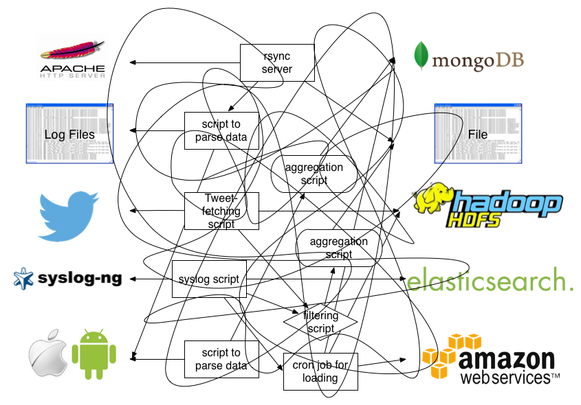
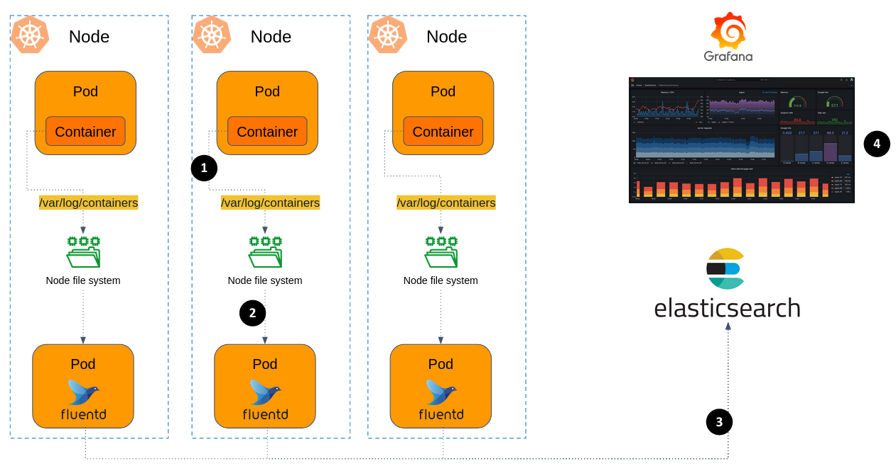

# Kubernetes Cluster Observability 

## Motivation and challenges 

Kubernetes cluster is great, but what about monitoring the cluster applications?

By **monitoring** we mean collecting logs and metrics from our containers and nodes. 

**Logs** are chronological records of events that occur within the app, typically in a semi-structured textual form.

**Metrics**, on the other hand, are quantitative measurements (numbers) that represent the state or performance of a system (e.g. CPU usage, network incoming traffic).
Since metrics are values that might change very rapidly, they often collected at regular intervals (e.g. every 15 seconds). 

Collecting logs and metrics from applications is important for several reasons, including:

- **Troubleshooting and Debugging**: investigate issues and bugs.
- **Performance Analysis**: gain insights into the system's behavior, identify performance bottlenecks.
- **Auditing**: Keep a historical record of audit events in your system.
- **Capacity Planning**: By analyzing metrics, you can gain insights into resource usage patterns, helping with scaling planning.
- **Business Intelligence (BI)**: Logs and metrics can contain valuable business insights, such as user behavior, preferences, and trends.

Monitoring clusters presents unique challenges stemming from the distributed nature of its components and the dynamic, ephemeral environment it operates in. 

- Pods are spread by k8s across dozen of Nodes.
- Pods are launched and terminated throughout the cluster's lifecycle, which lead to loss of critical logs from pods that was terminated.

In this tutorial we will set up a robust monitoring system for our cluster.

## Logs collection using FluentD and Kubernetes DaemonSets 

[Fluentd](https://www.fluentd.org/) is an open source data collector, which lets you unify the data collection and consumption for a better use and understanding of data.

Instead of writing your custom code that reads logs from one data source (e.g. MongoDB) and writes it to another storage (e.g. S3), FluentD offer a robust logs collector, which works many different [data sources](https://www.fluentd.org/datasources) and [data outputs](https://www.fluentd.org/dataoutputs).

| Before                                                 | After                                                        | 
|--------------------------------------------------------|--------------------------------------------------------------|
|  |  |


Fluentd has a flexible plugin system that allows the community to extend its functionality. There are [500+ community-contributed plugins](https://www.fluentd.org/plugins) that connect dozens of data sources and data outputs. 

### Deploying FluentD in Kubernetes

Our goal is to build a robust mechanism to collect logs from all Pods in the cluster, into a database (Elasticsearch). Then visualize the logs for different purposes using a dashboarding tool (Grafana). 

Here is the architecture:



1. [Pods in k8s cluster write logs](https://kubernetes.io/docs/concepts/cluster-administration/logging/) to `stdout` as well as to a log file located in `/var/log/containers/`. 

> #### Try it yourself
> 
> SSH into one of your cluster's node, take a look on `/var/log/containers` dir.

2. Now we want to deploy FluentD in our cluster, that collects the logs in real-time from every Node.

   FluentD will be deployed as a **DaemonSet**. 
   A DaemonSet ensures that **exactly one** instance of Pod runs on each node within the Kubernetes cluster. 
   
   Since logs collection involving reading log files from every Node, we want an instance of FluentD in each Node, otherwise we deal with cumbersome inter-node communication, increase traffic load, and potential data loss.
   When Fluentd is deployed as a DaemonSet, each node has its own Fluentd instance responsible for collecting logs from the containers running on that node. 

3. Each FluentD Pod is collecting logs into a local buffer, and every interval, sends the collected data into Elasticsearch (also will be deployed in the cluster).
   Elasticsearch is a No-SQL database. It is designed to handle large volumes of data and provides near real-time search and analytics capabilities. Elasticsearch is often used as the underlying engine for applications that require full-text search, log and event data analysis.

4. The Grafana server will visualize logs stored in Elasticsearch. 


Let's get started. Here are general guidelines, try to handle the deployment details yourself 💪:

1. Utilize `k8s/elasticsearch.yaml` to deploy Elasticsearch.
1. Provision FluentD using the [official Helm Chart](https://github.com/fluent/helm-charts/tree/main/charts/fluentd). In `k8s/fluent-values.yaml` you'll find a chart values override for FluentD to send traffic to your Elastic instance.  
1. Make sure Elastic receives data from FluentD. 
1. Visit your Grafana server, integrate the Elastic instance as a data source. 
1. In Grafana, enter the **Explore** page, observe the collected logs. 


## Collect metrics using Prometheus

[Prometheus](https://prometheus.io/docs/introduction/overview/) is a monitoring platform that collects metrics from [different platforms](https://prometheus.io/docs/instrumenting/exporters/) (such as databases, cloud providers, and k8s clusters).

Prometheus collects and stores its metrics as **time series** data, i.e. metrics information is stored with the timestamp at which it was recorded, alongside optional key-value pairs called **labels**.
Prometheus monitors its targets by using a **pull-based model**, where Prometheus periodically fetches metrics from the HTTP endpoints exposed by the targets.


1. Deploy Prometheus using the [community Helm chart](https://github.com/prometheus-community/helm-charts/tree/main/charts/prometheus). The Chart is already configured with the exporters needed to collect metrics from Pods and Nodes in your cluster. Use `k8s/prometheus-values.yaml` as the values override file. 
1. Integrate Prometheus into Grafana as a datasource.
1. In Grafana, import one of the following dashboards to get some insights about your cluster:
    - https://grafana.com/grafana/dashboards/6417-kubernetes-cluster-prometheus/
    - https://grafana.com/grafana/dashboards/315-kubernetes-cluster-monitoring-via-prometheus/
    - https://grafana.com/grafana/dashboards/12740-kubernetes-monitoring/

# Exercises

> [!NOTE]
> 
> Before start, make sure the online boutique service is deployed and specifically the 
> load generator service is working well.
> The load generator application creates realistic usage patterns on the website using Locust load generator.


### :pencil2: Investigate service regression issues

Let's see how to use Grafana in order to find performance issue in your app. 

1. Apply a version of the Online Boutique with injected issues: 

```bash
kubectl apply -f k8s/online-boutique/release-0.8.0-performence-issue.yaml
```

2. Wait a few minutes to let the load generator to create some synthetic load. 

Let's say your customers are complaining about the responsiveness of the website. It became REALLY slow. 
You try to find which microservice responsible for the latency increase and to which extent.  

3. In your Grafana server, go to the **Explore** page. 
4. Try to use the query wizard to investigate. You can take a look on the pod's raw logs, but it's better if you visualize it. Hints:

   - You can query the data using a [Lucene QL](https://www.elastic.co/guide/en/kibana/7.17/lucene-query.html).
   - The `http.resp.took_ms` value can help.
   - If you want to "group-by" do it with fields end with `.keyword`.

5. When you're done, take a look on the `k8s/online-boutique/release-0.8.0-performence-issue.yaml` file, fix the relevant values and deploy a fixed version. 