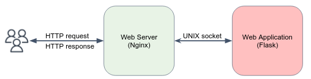
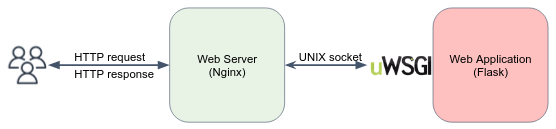

# Nginx Webserver

Based on: https://nginx.org/en/docs/

## Motivation 

So far, we've seen a simple web applications using Flask, but as your application grows, and you need to handle more traffic, you'll need additional tools to improve performance, security and scalability.
This is where Nginx comes in - it's a powerful web server that can act as an intermediary between your application and the internet, providing load balancing, reverse proxying, and security features that can help improve the performance and reliability of your web application. 

## Installation 

**Note**: throughout the tutorial you should work in a public EC2 instance in AWS.

Follow the official installation guideline for Ubuntu:  
https://nginx.org/en/linux_packages.html#Ubuntu

Make sure the Nginx service is up and running:

```console
$ sudo systemctl status nginx
● nginx.service - nginx - high performance web server
     Loaded: loaded (/lib/systemd/system/nginx.service; enabled; vendor preset: enabled)
     Active: active (running) since Thu 2023-04-27 06:58:53 UTC; 3s ago
       Docs: https://nginx.org/en/docs/
    Process: 12326 ExecStart=/usr/sbin/nginx -c /etc/nginx/nginx.conf (code=exited, status=0/SUCCESS)
   Main PID: 12327 (nginx)
      Tasks: 3 (limit: 1111)
     Memory: 3.9M
        CPU: 11ms
     CGroup: /system.slice/nginx.service
             ├─12327 "nginx: master process /usr/sbin/nginx -c /etc/nginx/nginx.conf"
             ├─12328 "nginx: worker process" "" "" "" "" "" "" "" "" "" "" "" "" "" "" "" "" "" "" ""
             └─12329 "nginx: worker process" "" "" "" "" "" "" "" "" "" "" "" "" "" "" "" "" "" "" ""

```

The above output discovers that Nginx is operating in the so-called **master-workers** architecture.

## Nginx architecture

Nginx has one master process and several worker processes.

The main purpose of the master process is to read and evaluate configuration, and maintain worker processes.
Worker processes do actual processing of requests, which are efficiently distributed among worker processes.
The number of worker processes is defined in the configuration file and may be fixed, or automatically adjusted to the number of available CPU cores.

By default, the configuration file is named `nginx.conf` and placed in the directory `/usr/local/nginx/conf`, `/etc/nginx`, or `/usr/local/etc/nginx`.

Changes made in the configuration file will not be applied until the command to reload configuration is sent to nginx or it is restarted. To reload configuration, execute:

```bash
nginx -s reload
```

Once the master process receives the signal to reload configuration, it checks the syntax validity of the new configuration file and tries to apply the configuration provided in it. If this is a success, the master process starts new worker processes and sends messages to old worker processes, requesting them to shut down.
Old worker processes, receiving a command to shut down, stop accepting new connections and continue to service current requests until all such requests are serviced. After that, the old worker processes exit.

## Nginx config file

Here is a sample of `nginx.conf` file:

```text
user  nginx;
worker_processes  auto;

error_log  /var/log/nginx/error.log notice;
pid        /var/run/nginx.pid;

events {
    worker_connections  1024;
}

http {
    include       /etc/nginx/mime.types;
    default_type  application/octet-stream;

    log_format  main  '$remote_addr - $remote_user [$time_local] "$request" '
                      '$status $body_bytes_sent "$http_referer" '
                      '"$http_user_agent" "$http_x_forwarded_for"';

    access_log  /var/log/nginx/access.log  main;

    sendfile        on;
    #tcp_nopush     on;

    keepalive_timeout  65;

    #gzip  on;

    include /etc/nginx/conf.d/*.conf;
}

```

Every entry the `nginx.conf` file is called a **Directive**. There are simple directives, such `user` and `pid`, and block directives, such as `http {...}`. 
Block directives contain other directives within them, which are applied only in the context of the parent directive (e.g. the `keepalive_timeout` within the `http` directive applies only to the `http` context.).
Directives placed in the configuration file outside of any contexts are considered to be in the [main](https://nginx.org/en/docs/ngx_core_module.html) context.

Here are a few interesting directives explained: 

- The `events` directive specifies settings for the nginx **event loop** (the core engine of Nginx), which handles client connections. The `worker_connections` directive specifies the maximum number of client connections that a worker process can handle simultaneously.
- The `http` directive contains configuration settings for the HTTP server.
- The `sendfile` directive enables or disables serving static files
- The `include /etc/nginx/conf.d/*.conf;` directive includes any `.conf` files in the `/etc/nginx/conf.d/` directory. This is typically used to include additional configuration files that define virtual hosts or other server settings.


## Serve static content 

Try to communicate with your webserver by visiting:

```text
http://<your-instance-ip>
```

The "Welcome to nginx!" page should be served by default. 

**Note**: your machine should accept incoming traffic on port `80`.

An important web server task is serving out files (such as images or static HTML pages).

Let's override the default configurations and implement some static content serving. 
Files will be served from different local directories: `/data/www` (which may contain HTML files) and `/data/images` (containing images).

1. Create the `/data/www` and `/data/images` directories. 
2. Open the default conf file, which is located under `/etc/nginx/conf.d/default.conf`. 

The default configuration file already includes several examples in the `server` block, mostly commented out.

The `location` block sets configuration depending on a request URI (URI is basically like URL, but without the protocol. e.g. URL: http://google.com, URI: google.com).
Take a look on the `location / {...}` block:

```text
 location / {
        root   /usr/share/nginx/html;
        index  index.html index.htm;
    }
```

This block defines that every request URI that matches the `/` prefix, will be served according to the definitions of this block. 
In this case, all content is being served from `/usr/share/nginx/html`, and if otherwise not specified, the default served pages are `index.html` or `index.htm`.

If there are several matching location blocks nginx selects the one with the **longest prefix**.

3. Let's override this location to:
    ```text
     location / {
            root   /data/www;
        }
    ```

4. Next, add the second location block:

   ```text
   location /images/ {
        root /data;
    }
   ```

It will be a match for requests starting with `/images/` (location `/` also matches such requests, but has shorter prefix).

In response to requests with URIs starting with `/images/`, the server will send files from the `/data/images` directory.
For example, in response to the `http://<server-ip>/images/example.png` request nginx will send the `/data/images/example.png` file.
If such file does not exist, nginx will send a response indicating the 404 error (Why? How?). 

Requests with URIs not starting with `/images/` will be mapped onto the `/data/www` directory.
For example, in response to the `http://<server-ip>/some/example.html` request nginx will send the `/data/www/some/example.html` file.

5. To apply the new configuration, send the reload signal to the nginx’s master process, by executing:
   ```bash
   nginx -s reload
   ```

In case something does not work as expected, you may try to find out the reason in `access.log` and `error.log` files in the directory `/usr/local/nginx/logs` or `/var/log/nginx`.


## Multiple `server`s

Generally, the configuration file may include several `server` blocks distinguished by ports on which they listen to and by server names.

Nginx first decides which server should process the request. 
Let’s see a simple configuration with three virtual servers listen on port `80`, and another server listen on port `8080`:

```text
server {
    listen      80 default_server;
    server_name example.org www.example.org;
    ...
}

server {
    listen      80;
    server_name example.net www.example.net;
    ...
}

server {
    listen      80;
    server_name example.com www.example.com;
    ...
}

server {
    listen      8080;
    server_name example.com www.example.com;
    ...
}
```

In this configuration, in case that the webserver is accessed with port `80`, nginx tests the request’s header field `Host` to determine which server the request should be routed to.
In case the server is accessed with port `8080`, nginx route in request to the last server.  

If its value does not match any server name, or the request does not contain this header field at all, then nginx will route the request to the default server for this port.


## Reverse Proxy

### Forward (regular) proxy vs Reverse Proxy

A **forward proxy** (or just "proxy") is a server that sits between a client and a server and forwards requests from the client to the server **on behalf of the client**.
The client is **aware** of the proxy and sends its requests to the proxy, which then makes the request to the server and returns the response to the client.


A **VPN** (Virtual Private Network) can be considered a type of forward proxy that encrypts and tunnels all traffic between a client and a server, allowing the client to securely access the server and bypass network restrictions.

A **reverse proxy**, on the other hand, sits between a client and a server and forwards requests from the client to one or more servers **on behalf of the server**. 
The client **is not aware** of the reverse proxy, it sends its requests to the server, and the server forwards the requests to the reverse proxy, which then forwards them to one or more backend servers.


### Nginx Reverse Proxy

Nginx reverse proxy is a common technique used to evenly distribute traffic among multiple servers, seamlessly display content from various websites, or transfer requests for processing to **application servers** (e.g. the Flask backend in `simple_flask_webserver`!) through non-HTTP protocols.

Let's see an example. 

1. Add the below `location` directive to your `server`:

```text
location /some/path/ {
    proxy_pass http://127.0.0.1:8080;
}
```

2. Reload your Nginx master to apply the new configurations. For the website to work, you should copy the file of `simple_flask_webserver` into your machine, install `pip` requirements, and run the server.  

By default, Nginx redefines two header fields in proxied requests, `Host` (set to the $proxy_host [variable](https://nginx.org/en/docs/http/ngx_http_core_module.html#variables)) and `Connection` (set to `close`).

3. To change these setting, as well as modify other header fields, use the [`proxy_set_header`](https://nginx.org/en/docs/http/ngx_http_proxy_module.html#proxy_set_header) directive.

```text
location /some/path/ {
    proxy_set_header Host $host;
    proxy_set_header X-Real-IP $remote_addr;
    proxy_pass http://localhost:8080;
}
```

## Serve dynamic content using the simple Flask webserver

We would like first differentiate between **web application** and **web server**.



Nginx is a web server, by means that it is a general engine that serves HTTP requests and responses, for any application, regardless the content and that is being served, and the programing language. 
Web server responsibility: 

- Static content
- Scale (multiprocess)
- Rate limit
- Cache
- TLS termination
- Load balancing
- Security
- Multiple applications
- Authentication


A web application, on the other hand, is responsible for the product logic and functionality, generating dynamic content per request, such as authentication, form submission, and data processing.
Web applications are built on top of web servers and rely on them to serve content to clients.
Web application responsibilities: 

- API implementation
- Backend
- Business logic
- UI
- Authentication

**Note**: You can argue (and you'll be right) that we've already communicat with the Flask webserver using HTTP. So why suddenly we are bothering you with web servers like Nginx?
You are correct, Flask can serve HTTP requests directly, because it comes with a built-in **development server**. However, the built-in server is not recommended for production use, as it is not optimized for performance or security.
For example, the Flask development server is single-threaded, which means it can only handle one request at a time.
Nginx, for comparison, can handle more than 10,000 simultaneous connections per second on a single server.

So we want both of them, Nginx as the HTTP request processing engine, and Flask, as our "backend". 
Here WSGI comes in...

As can be seen in the above figure, Nginx communicates with web applications using **UNIX sockets** (this is the most high-performed way), but Python, is not well-suited for serving requests over sockets directly.
You need to write some code and implement the interface between Nginx and your Python app. Lucky us, there is even a well-defined interface for that, called [WSGI](https://peps.python.org/pep-0333/).  

A Web Server Gateway Interface (**WSGI**) server, is a tiny wrapper around Flask that implements the WSGI interface for running Python web applications that can serve HTTP requests from Nginx, Apache, and more...

### uWSGI

[uWSGI](https://uwsgi-docs.readthedocs.io/en/latest/) is an implementation of the WSGI interface (there are many more...).



Let's serve the Flask webserver behind a uWsgi server. 

1. If you haven't done it yet, copy the files under `simple_flask_webserver` into the home directory of your VM (should be `/home/ubuntu`).

```bash
scp -r -i "<your-key>" /path/to/DevOpsFeb23/simple_flask_webserver/ ubuntu@<instance-public-ip>:~/
```

2. Install `pip` the Python packaging tool by `sudo apt install python3-pip`.
3. Now install uWSGI and Flask using `pip` by: `pip install uwsgi flask`.
4. Let's test first that the regular Flask app is working by:

```bash
cd simple_flask_webserver
python3 app.py
```

Make sure you are able to access the website from your browser. At the end **close this process**.

5. Now let's run the application behind the `uwsgi` by:

```bash
uwsgi uwsgi.ini
```

The `.ini` file instructs uwsgi how to run the Flask web application, where is the entrypoint file, which port will the socket use. Take a look on it, by no need to delve into details here. 

You should **leave this process running** for the next steps, unless otherwise specified. 

6. Change the default configurations on your Nginx. Override the `location` directive in `/etc/nginx/conf.d/default.conf` by the following:

```text
location / {
     include uwsgi_params;
     uwsgi_pass 127.0.0.1:3031;
 }
```

7. Reload the Nginx server by `nginx -s reload`. 
8. Make sure the application is available publicly by visiting from you web browser:

```text
http://<instance-public-ip>
```

Great. The only this left, is to run the uwsgi process **as a (linux) service**, so we can exit the remote machine and everything will keep running (even after the VM is rebooted).
We've already discussed [Linux services](linux_processes.md#services).

9. Stop the `uwsgi uwsgi.ini` process, as we are going to run is as a Linux service. 
10. Copy `simple_flask_webserver/uwsgi-flask.service` to `/etc/systemd/system/uwsgi-flask.service`. This is a **unit file** that specifies the service configuration.
11. After creating the unit file, you can enable and start the service with the following commands:

```bash
sudo systemctl enable uwsgi-flask
sudo systemctl start uwsgi-flask
```

`start` is used to start a service immediately, but does not configure the service to start automatically at boot time. 
This means that the service will run until the system is rebooted, at which point it will need to be started manually again.

`enable` is used to configure a service to start automatically at boot time.

11. Check the service status by: `sudo systemctl status uwsgi-flask`.

# Self-check questions

[Enter the interactive self-check page](https://alonitac.github.io/__REPO_NAME__/multichoice-questions/webservers_nginx.html)


# Exercises 

### :pencil2: Extend the static content serving functionality 

1. Add a `location` directive that serves **exactly** the `/` prefix. E.g. `http://localhost/` will be served, while `http://localhost/hello.html` won't.  
2. Using regular expression, add a `location` that serves only files ends with `.pdf`, `.git`, `.docx`, under any subdirectory. E.g. `http://localhost/dir1/dir2/test.pdf`, `http://localhost/test.gif`, `http://localhost/documents/doc.docx`.
3. Although not recommended, use [if statement](https://www.nginx.com/resources/wiki/start/topics/depth/ifisevil/) in a `location` block, to match URLs that contain a specific query parameter: `foo=bar` and return [I'm a teapot](https://developer.mozilla.org/en-US/docs/Web/HTTP/Status/418) status code. 
   In addition, if the request method is POST, the server returns [Method not allowed](https://developer.mozilla.org/en-US/docs/Web/HTTP/Status/405) status code. 


### :pencil2: Add another server

Add another `server` directive listening on port `8080`. Create some `location` configurations to serve static content and test it. 


### :pencil2: Internal server

Review the [listen](https://nginx.org/en/docs/http/ngx_http_core_module.html#listen) directive and create a `server` that listens from requests originated from `127.0.0.1` only. Test that the server is accessible only internally.


### :pencil2: Don't process requests with undefined server names

Configure a `server` which blocks any requests without the Host header. The server should return a `400` status code (bad request). Test your server.

### :pencil2: Caching 

Follow [Shesh's blog](https://www.sheshbabu.com/posts/nginx-caching-proxy/) to add caching functionality to your proxy.


### :pencil2: Load balancing using reverse proxy

Review the [upstream](https://nginx.org/en/docs/http/ngx_http_upstream_module.html) directive Nginx official docs, and use the below example configuration to create a reverse proxy which will balance the requests load among 2 different, identical servers:

```text
http {
upstream backend {
server 127.0.0.1:8080;
server 127.0.0.1:8081;
}

    server {
        listen 80;
        server_name example.com;

        location / {
            proxy_pass http://backend;
            proxy_set_header Host $host;
            proxy_set_header X-Real-IP $remote_addr;
        }
    }
}
```

You should run 2 different Python Flask backends (the one provided under `simple_flask_webserver` dir in our shared repo). One listens to port 8080, the other to port 8081.
Make sure the traffic is distributed over the two backends (almost) evenly. 

